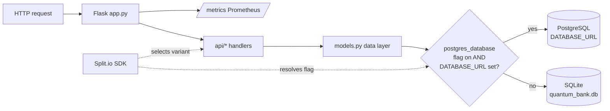

<div align="center">

# 🏦 Quantum Bank

**A Flask banking demo where the database backend is a feature flag.**

Flip a Split.io treatment and the same app moves from SQLite to PostgreSQL —
no redeploy, instant rollback. Wrapped in a polished bank UI that also
showcases live, refresh-free Split.io variant switching.

[](https://www.python.org/)
[](https://flask.palletsprojects.com/)
[](https://www.split.io/)
[](HARNESS.md)
[](test/)
[](LICENSE)

</div>

> [!IMPORTANT]
> **Demonstration app — all data is synthetic.** Quantum Bank is not a real
> bank, holds no real money, and is **not** a security or banking reference.
> Card records store a masked last-4 only (no PAN, no CVV). Do not reuse the
> auth or session handling in production.

---

## Why it's interesting

Most demos show feature flags toggling a button color. Quantum Bank uses one to
toggle **the entire persistence layer**:

- A `postgres_database` flag (Split.io → env var → default) decides, at runtime,
  whether queries hit **SQLite** or **PostgreSQL**.
- The switch is **reversible in seconds** — if Postgres misbehaves, flip the
  flag off and the app falls back to SQLite without a deploy.
- A built-in **safety guard**: even with the flag on, the app stays on SQLite
  unless `DATABASE_URL` is actually set (and logs a warning), so a half-finished
  rollout can't take the app down.

The same Split.io machinery also drives the front end: home/pricing pages render
as flag-selected variants, with a "demo mode" that pre-loads variants for
**instant, refresh-free switching** during a live demo.

## Highlights

- 🔀 **Flag-gated SQLite ↔ PostgreSQL backend** — runtime switch, instant
  rollback, `DATABASE_URL`-guarded ([db_flags.py](db_flags.py), [models.py](models.py)).
- 🎛️ **Split.io feature flags, server + browser** — server SDK picks templates
  and the DB backend; the [browser SDK](static/js/split-client.js) reacts to flag
  changes live in demo mode.
- 🧪 **Backend-agnostic data layer** — one set of query functions runs on both
  engines (param translation, `RETURNING id` vs `lastrowid`, `Decimal`
  normalization). Tests run against either backend from the same suite.
- 📊 **Prometheus `/metrics`** — request count + latency, exposed by a tiny
  dependency-free exposition module ([prometheus_minimal.py](prometheus_minimal.py)).
- 🐳 **Dockerized & deployable** — Gunicorn image, `render.yaml` for Render,
  generic `DATABASE_URL` for any managed Postgres.
- ✅ **Harness CI** — runs the full pytest suite plus OWASP Dependency-Check and
  OSV SCA scans on every build ([HARNESS.md](HARNESS.md)).

## Screenshots

> [!NOTE]
> Screenshots aren't captured yet. See
> [docs/screenshots/](docs/screenshots/README.md) for exactly which pages to
> grab (`dashboard`, `login`, `transfer`); drop the PNGs there and the images
> below will render.

<!--  -->
<!--  -->
<!--  -->

## Quick start (local)

### Default — SQLite, zero config

```bash
python -m venv venv
source venv/bin/activate          # Windows: venv\Scripts\activate
pip install -r requirements.txt
cp .env.example .env              # set SPLIT_API_KEY and SECRET_KEY
python app.py                     # → http://localhost:5001
```

The app creates `quantum_bank.db` and seeds it on first run. Log in with the
seeded user **`demo`** (no password — demo only).

> Split.io is optional locally: without `SPLIT_API_KEY` the app logs a warning
> and falls back to env-var / default treatments, so every page still works.

### PostgreSQL — native local install

Install and run Postgres on your machine (Homebrew on macOS), set
`DATABASE_URL` + `POSTGRES_DATABASE=on`, then start the app.

**Full guide:** [docs/LOCAL_POSTGRES.md](docs/LOCAL_POSTGRES.md)

```bash
# After Postgres is running and quantum_bank exists (see guide):
export DATABASE_URL="postgresql://YOUR_OS_USER@localhost:5432/quantum_bank"
export POSTGRES_DATABASE=on
python app.py                     # → http://localhost:5001
```

If `POSTGRES_DATABASE=on` but `DATABASE_URL` is unset, the app **stays on
SQLite** and warns — by design.

## Architecture



### Backend selection matrix

The data layer resolves the backend on each `get_db()` call. Resolution order
for the flag is **Split.io treatment → `POSTGRES_DATABASE` env var → off**.

| `postgres_database` flag | `DATABASE_URL` | Backend used | Notes |
|--------------------------|----------------|--------------|-------|
| off (default)            | anything       | **SQLite**   | Zero-config local default |
| on                       | set            | **PostgreSQL** | Schema from [`migrations/001_initial.sql`](migrations/001_initial.sql) |
| on                       | unset          | **SQLite**   | Guard fires; logs a warning |

## Configuration

Copy [`.env.example`](.env.example) to `.env`. No real secrets are committed.

| Variable | Purpose | Default |
|----------|---------|---------|
| `SPLIT_API_KEY` | Split.io **server-side** SDK key. Omit to run on env/default treatments. | _(none)_ |
| `SECRET_KEY` | Flask session signing key. **Set a real one for any shared deployment.** | dev fallback string |
| `DATABASE_URL` | PostgreSQL connection string. Required for the Postgres backend. | _(unset → SQLite)_ |
| `POSTGRES_DATABASE` | Env fallback for the `postgres_database` flag (`on`/`off`). | `off` |
| `DEMO_MODE` | Front-end demo mode fallback when Split is unavailable (`on`/`off`). | `off` |
| `QUANTUM_BANK_DATABASE` | Override SQLite file path (used to isolate test DBs). | `quantum_bank.db` |

The **browser** SDK key lives in [`static/js/split-client.js`](static/js/split-client.js)
(client-side keys are safe to expose). See [SPLITIO_SETUP.md](SPLITIO_SETUP.md)
for flag definitions (`home_page_variant`, `demo_mode`, `postgres_database`).

## Testing

```bash
pytest                 # 60 tests, SQLite by default
pytest -m models       # data-layer + backend-resolution tests
pytest -m "api or banking"   # route-level tests
```

Markers (see [pytest.ini](pytest.ini)): `public`, `banking`, `api`, `models`.

> [!NOTE]
> **TODO — add lint tooling.** There is no ruff/black (or pre-commit) config in
> the repo yet, and no lint step in CI. Add `ruff` + `black` config and a lint
> stage to the Harness pipeline, then surface a code-style badge here.

The data-layer tests run against **either** backend when env vars point at Postgres.
See [docs/LOCAL_POSTGRES.md](docs/LOCAL_POSTGRES.md) for native setup and test commands.

> [!NOTE]
> **Postgres matrix in CI (CHUNK_3).** Harness runs pytest twice — SQLite (`POSTGRES_DATABASE=off`)
> and Background `postgres:16` (`DATABASE_URL` + `POSTGRES_DATABASE=on`) — with separate JUnit
> reports. See [HARNESS.md](HARNESS.md) and `.harness/pipelines/rodbank-pipeline-ci-reference.yaml`.
>
> This matters because some bugs are **Postgres-only** and a SQLite-only CI run
> stays green through them — e.g. Postgres returns `created_at` as a `datetime`
> while SQLite returns a string, so template date handling can pass on SQLite and
> 500 on Postgres. Running the suite against both backends catches that drift
> before a flag flip exposes it live.

## Deployment

| Target | How | Doc |
|--------|-----|-----|
| **Local SQLite** | `python app.py` | this README |
| **Local Postgres** | Native install + `DATABASE_URL` | [docs/LOCAL_POSTGRES.md](docs/LOCAL_POSTGRES.md) |
| **Render** | `render.yaml` + Dockerfile; set `SPLIT_API_KEY`, `SECRET_KEY` | [RENDER_DEPLOYMENT.md](RENDER_DEPLOYMENT.md) |
| **Any managed Postgres** | Set `DATABASE_URL` + `POSTGRES_DATABASE=on` | above |
| **Kubernetes (lab)** | Manifests under [`.harness/kubernetes/`](.harness/kubernetes/) | [HARNESS.md](HARNESS.md) |

The production image runs Gunicorn (`Dockerfile`); Render injects `$PORT`.

## Documentation

| Doc | What it covers |
|-----|----------------|
| [docs/LOCAL_POSTGRES.md](docs/LOCAL_POSTGRES.md) | **Native local Postgres** — Homebrew install, env, smoke, tests |
| [docs/demos/rewards-rollout.md](docs/demos/rewards-rollout.md) | Step-by-step rollout walkthrough (baseline -> fallback -> ready -> forced fail -> recovery) |
| [demo-fun.md](demo-fun.md) | **Why** the app is shaped this way — demo spectacle vs. a "real" site for testers/AITs |
| [TECHSUMMARY.md](TECHSUMMARY.md) | Architecture, flags, templates, metrics, file map |
| [SPLITIO_SETUP.md](SPLITIO_SETUP.md) | Split.io keys and feature-flag setup |
| [RENDER_DEPLOYMENT.md](RENDER_DEPLOYMENT.md) | Deploying to Render (Docker, env vars, custom domain) |
| [HARNESS.md](HARNESS.md) | Harness CI pipeline, SCA triage, CI vs CD split |

## Lessons learned (rewards rollout)

- **Caller-owned savepoint matters:** placing the savepoint around the rewards call in `transfer_money` (not inside the helper) keeps core transfers safe even when rewards logic is monkeypatched or fails unexpectedly.
- **Parity catches real bugs:** SQLite and Postgres can both pass happy paths while diverging on failure semantics; running both lanes is what made regression checks trustworthy.
- **Contract-first tests scale:** stable `data-testid`/`data-kind` assertions kept UI copy flexible while making rollout states precise and reviewable.
- **Prove the gate, not just green:** a deliberate-break CI drill was essential to show tests truly gate behavior instead of producing false confidence.

## Rewards rollout architecture

```mermaid
flowchart TD
    A[Rollout flags<br/>SCHEMA / FEATURE / FORCE_FAIL] --> B[init_db<br/>ensure_rewards_ledger_schema]
    B --> C[_rewards_schema_state<br/>ready/skipped/forced_fail/runtime_error]

    T[transfer_money] --> SP[SAVEPOINT around rewards call]
    SP --> W[try_insert_rewards_points]
    C --> W
    W -->|success| WS[rewards.rollout.write_succeeded]
    W -->|error| WF[rewards.rollout.write_failed]
    SP --> TC[core transfer commit stays authoritative]

    D[/dashboard] --> R[get_rewards_points_for_user]
    C --> R
    R -->|points| UI1[data-testid='rewards-points']
    R -->|banner kind| UI2[data-testid='rewards-banner'<br/>data-kind enum]
    R -->|read error| RF[rewards.rollout.read_failed]
```

## Disclaimer & license

Quantum Bank is a **demonstration application**. All accounts, balances,
transactions, and cards are **synthetic**. It is not a real financial product
and not intended as a reference for security or banking implementations. See
[SECURITY.md](SECURITY.md) for the security posture and how to report issues.

Licensed under the [MIT License](LICENSE).
